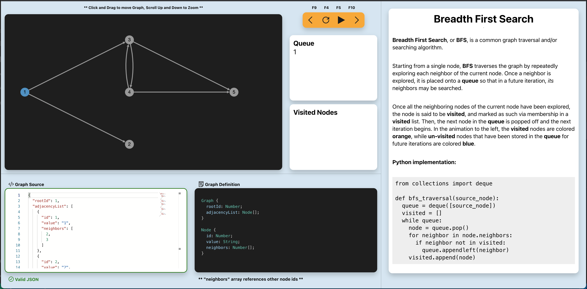

Algo Helper is a project that provides visualizations and animations of common algorithms. Born out of the scarcity of algorithm visualization tools, it functions as an interactive web app with custom data inputs, a debugger, and brief written explanations.

My hope is that this can be a learning tool for conceptualizing computer science algorithms. The project is in early stages and currently supports *Breadth First Search*! More algos to follow...

# Prerequisites
* Git
* [Docker](https://www.docker.com/products/docker-desktop)
* Web Browser

# Usage
## Startup 
First, clone the repo.
```bash
git clone https://github.com/brockwade633/algo-helper.git
```

Inside the ```algo-helper``` folder, build and run the image.
```bash
cd algo-helper
```
build and tag image in the current directory.
```bash
docker build -t algo-helper:latest .
```
run the container in interactive mode with the appropriate port binding, removing once stopped.
```bash
docker run -it -p 1234:80 --rm algo-helper:latest

```
Access the web app at [http://localhost:1234](http://localhost:1234)

## App Walkthrough 



### Split Panes
The different areas of the user interface are divided into adjustable panes - click and drag the edge of a pane horizontally or vertically to enlarge a specific area when engaging with it.

### Debugger
The debugger is located near the top of the interface and contains back, reset, play, pause, and forward controls, triggered by button clicks as well as the labeled key presses. Use the debugger to step forwards and backwards through the algorithm, play it continuously, or reset from the beginning. The progress of the algorithm can be tracked with the visual of the graph, as well as the panes showing the data structures leveraged by the algorithm and their current state.

### Graph Source & Definition
The graph source on the bottom left represents the input graph to be acted upon by the algorithm. It is a json representation that must conform to the simple adjacency list definition shown to its right. A simple graph is automatically loaded as a default, but any input graph may be typed or pasted into the source window. As long as the input graph validates successfully against the definition, it will be used for any subsequent algorithm iterations.

### Commentary
The rightmost pane contains a brief commentary describing the algorithm, and an example implementation in code.

# Contribute
Have an algorithm you'd like to add to the mix? Contributions are welcome! More instructions will be provided shortly.